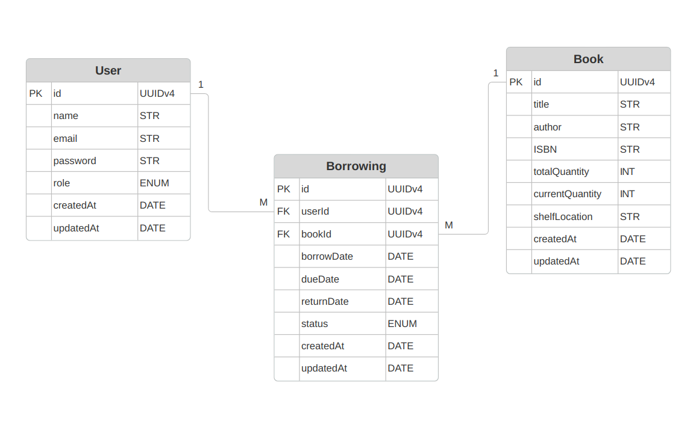

# Library Management System

This project is a Library Management System API built with Node.js and Express. It provides endpoints for managing books, borrowings, and users, with an emphasis on role-based access control and request validation.

## Features

- User Management: Register, update, delete, and list users.
- Authentication: Secure authentication using JSON Web Tokens (JWT).
- Book Management: Add, update, delete, and retrieve book details.
- Book Search: A Simplified fuzzy search to find books by title, author, or ISBN.
- Borrowing Management: Manage borrowing processes, including borrowing and returning books, as well as checking for overdue - borrowings.
- Automated Overdue Checks: A scheduled job runs daily to check for and manage overdue borrowings automatically.
- Role-Based Access Control: Assign specific permissions to different user roles (e.g., admin, borrower) to enhance security.
- Rate Limiting: Implement fixed window rate limiting using Redis to monitor and control user access based on IP addresses.

## ERD


## Installation

1. Clone the repository

    ```
    git clone https://github.com/mohmoussad/Library-Management-System.git
    ```

2. Copy the `.env.example` to `.env` and fill in the necessary configuration variables.

3. Ensure that the following ports are not currently in use:

   - 3000 (for the Express Application)
   - 5432 (for PostgreSQL)
   - 6379 (for Redis)

4. Launch the application using Docker Compose:

    ```
    docker-compose up --build
    ```

5. Explore API Swagger Documentation on path ```localhost:3000/api/docs```

## Technologies Used
- Node.js
- Express.js
- PostegreSQL and Sequalize
- Redis
- Docker and Docker Compose
- JWT and Bcryptjs
- Winston and Morgan
- Joi
- Swagger
